# 2025-12-13_02-30_COMPREHENSIVE_EXECUTION_PLAN

## Executive Summary

**Date:** 2025-12-13 02:30 CET  
**Project:** GoReleaser-Wizard  
**Plan Type:** Comprehensive Execution Plan  
**Total Tasks:** 125 Detailed Tasks  
**Estimated Duration:** 14 Hours  
**Target Production Readiness:** 85%  

---

## Impact Analysis Framework

### **1% Effort → 51% Result (CRITICAL - 2 Hours)**
Tasks that deliver massive customer value with minimal effort.

### **4% Effort → 64% Result (HIGH IMPACT - 4 Hours)**  
Tasks that significantly enhance functionality with moderate effort.

### **20% Effort → 80% Result (PRODUCTION FEATURES - 8 Hours)**
Tasks that complete the product with comprehensive features.

---

## Mermaid Execution Graph

```mermaid
graph TD
    %% Critical Path (1% → 51% Result)
    A[Research GitHub Actions Template Solutions<br/>15min] --> B[Implement Custom Template Delimiters<br/>15min]
    B --> C[Test GitHub Actions Template<br/>15min]
    C --> D[Fix All GitHub Actions Tests<br/>20min]
    
    %% Advanced Template Data (30min)
    E[Fix Docker Registry Template Data<br/>15min] --> F[Fix Docker Image Name Mapping<br/>15min]
    F --> G[Fix Signing Template Data<br/>15min]
    G --> H[Create Homebrew Template Data<br/>15min]
    
    %% Test Infrastructure (45min)
    I[Mock goreleaser Binary<br/>15min] --> J[Mock cosign Binary<br/>15min]
    J --> K[Mock docker Binary<br/>15min]
    K --> L[Create Isolated Test Environment<br/>15min]
    
    %% Performance & Validation (45min)
    M[Fix Performance Test Timing<br/>25min] --> N[Add goreleaser check Integration<br/>20min]
    
    %% High Impact Features (4% → 64% Result)
    O[Implement Docker Configuration<br/>40min] --> P[Implement Signing Configuration<br/>35min]
    P --> Q[Implement Homebrew Configuration<br/>35min]
    
    %% Medium Impact Features (4 hours)
    R[Add Mock Dependency System<br/>45min] --> S[Create Test Environment Isolation<br/>30min]
    S --> T[Add Configuration Preview<br/>25min]
    T --> U[Enhance Template Validation<br/>30min]
    U --> V[Fix State Transitions<br/>20min]
    V --> W[Add Error Recovery<br/>40min]
    
    %% Production Features (20% → 80% Result)
    X[Add Multi-Binary Support<br/>60min] --> Y[Enhance Project Detection<br/>50min]
    Y --> Z[Add Advanced Build Options<br/>35min]
    Z --> AA[Add Interactive Wizard<br/>75min]
    AA --> BB[Create Documentation<br/>90min]
    BB --> CC[Add Performance Optimization<br/>45min]
    CC --> DD[Implement Configuration Migration<br/>40min]
    DD --> EE[Add CI/CD Platform Integrations<br/>55min]
    
    %% Parallel Execution Groups
    subgraph "Group 1: Critical Infrastructure (2h)"
        A --> B --> C --> D
        E --> F --> G --> H
        I --> J --> K --> L
        M --> N
    end
    
    subgraph "Group 2: Core Features (4h)"
        O --> P --> Q
        R --> S --> T --> U --> V --> W
    end
    
    subgraph "Group 3: Production Features (8h)"
        X --> Y --> Z --> AA --> BB --> CC --> DD --> EE
    end
    
    %% Dependencies
    Group1 --> Group2
    Group2 --> Group3
    
    %% Success Gates
    Gate1{GitHub Actions Working?} --> Gate2{All Tests Passing?}
    Gate2 --> Gate3{Core Features Complete?}
    Gate3 --> Gate4{Production Ready?}
```

---

## Phase 1: Critical Infrastructure (2 Hours - 51% Result)

### **Showstopper Resolution (45 minutes)**
| Priority | Task | Duration | Success Criteria | Dependencies |
|---|---|---|---|---|
| 1 | Research GitHub Actions template syntax solutions | 15min | Identify viable solution for Go template vs GitHub Actions syntax conflict | |
| 2 | Implement custom template delimiters for GitHub Actions | 15min | GitHub Actions templates can be parsed without errors | Task 1 |
| 3 | Test GitHub Actions template with new delimiters | 15min | All GitHub Actions generation tests pass | Task 2 |

### **Template Data Mapping (30 minutes)**
| Priority | Task | Duration | Success Criteria | Dependencies |
|---|---|---|---|---|
| 4 | Fix Docker registry string conversion in templates | 15min | Docker registry renders correctly in all templates | |
| 5 | Fix Docker image name mapping in templates | 15min | Docker image names render correctly in all templates | Task 4 |
| 6 | Add Docker build flag templates data mapping | 15min | Docker build flags render correctly in templates | Task 5 |
| 7 | Fix Signing cosign command template data | 15min | Cosign commands render correctly in templates | |
| 8 | Add Signing certificate template data mapping | 15min | Signing certificates render correctly in templates | Task 7 |
| 9 | Create Homebrew repository template data | 15min | Homebrew repository info renders correctly | |
| 10 | Add Homebrew folder structure template data | 15min | Homebrew folder structure renders correctly | Task 9 |
| 11 | Add Homebrew description template data mapping | 15min | Homebrew descriptions render correctly | Task 10 |

### **Test Infrastructure Stabilization (45 minutes)**
| Priority | Task | Duration | Success Criteria | Dependencies |
|---|---|---|---|---|
| 12 | Mock goreleaser binary for testing | 15min | Tests can run without goreleaser installation | |
| 13 | Mock cosign binary for testing | 15min | Tests can run without cosign installation | Task 12 |
| 14 | Mock docker binary for testing | 15min | Tests can run without docker installation | Task 13 |
| 15 | Create isolated test environment setup | 15min | Tests run in clean, predictable environment | Task 14 |
| 16 | Add test fixture data for reproducible tests | 15min | Test results are consistent across runs | Task 15 |
| 17 | Fix performance test timing issues | 25min | Performance tests pass reliably | Task 16 |
| 18 | Add goreleaser check integration | 20min | Generated configs validated automatically | Task 17 |

---

## Phase 2: Core Features (4 Hours - 64% Result)

### **Advanced Configuration Implementation (1h 50min)**
| Priority | Task | Duration | Success Criteria | Dependencies |
|---|---|---|---|---|
| 19 | Implement complete Docker configuration generation | 40min | Docker sections render correctly with all options | Phase 1 |
| 20 | Implement complete Signing configuration generation | 35min | Signing sections render correctly with cosign | Phase 1 |
| 21 | Implement complete Homebrew configuration generation | 35min | Homebrew sections render correctly with metadata | Phase 1 |
| 22 | Add configuration preview before file generation | 25min | Users can review config before file creation | Phase 1 |
| 23 | Add user confirmation for configuration generation | 15min | Users must confirm before config files created | Task 22 |

### **Template System Enhancement (1h)**
| Priority | Task | Duration | Success Criteria | Dependencies |
|---|---|---|---|---|
| 24 | Add comprehensive template syntax validation | 15min | Template errors caught before rendering | Phase 1 |
| 25 | Add template error reporting with specific guidance | 15min | Template errors include actionable suggestions | Task 24 |
| 26 | Fix ConfigState transition validation logic | 15min | State transitions work correctly | Phase 1 |
| 27 | Add state transition rollback functionality | 15min | Failed operations can be rolled back | Task 26 |

### **Error Recovery & Robustness (1h 10min)**
| Priority | Task | Duration | Success Criteria | Dependencies |
|---|---|---|---|---|
| 28 | Add error recovery for missing template files | 15min | Graceful fallback when templates missing | Phase 1 |
| 29 | Add error recovery for permission issues | 15min | Clear guidance when file permissions blocked | Task 28 |
| 30 | Add error recovery for git repository issues | 15min | Handles git errors gracefully | Task 29 |
| 31 | Add error recovery for invalid configurations | 15min | Provides specific guidance for invalid configs | Task 30 |
| 32 | Add comprehensive error logging and debugging | 20min | Detailed logs for troubleshooting issues | Task 31 |

---

## Phase 3: Production Features (8 Hours - 80% Result)

### **Multi-Binary & Project Detection (1h 50min)**
| Priority | Task | Duration | Success Criteria | Dependencies |
|---|---|---|---|---|
| 33 | Add multi-binary detection logic | 15min | Projects with multiple binaries detected | Phase 2 |
| 34 | Add multi-binary template generation | 15min | Multiple binaries rendered in GoReleaser config | Task 33 |
| 35 | Add project type detection from code structure | 15min | Projects classified correctly by type | Task 34 |
| 36 | Add monorepo support | 15min | Monorepo structures detected and handled | Task 35 |
| 37 | Add cmd structure detection | 15min | cmd/*/main.go patterns detected | Task 36 |
| 38 | Enhance project name detection from git/module | 15min | Project names detected accurately | Task 37 |
| 39 | Add Go module parsing for complex projects | 15min | Complex Go modules parsed correctly | Task 38 |
| 40 | Add build constraints detection | 15min | Build tags and constraints detected | Task 39 |

### **Advanced Build Options (1h 10min)**
| Priority | Task | Duration | Success Criteria | Dependencies |
|---|---|---|---|---|
| 41 | Add custom LDFlags configuration | 15min | Custom LDFlags can be specified | Phase 2 |
| 42 | Add build tags configuration | 15min | Custom build tags can be specified | Task 41 |
| 43 | Add build constraints configuration | 15min | Custom build constraints can be specified | Task 42 |
| 44 | Add cross-compilation options | 15min | Cross-compilation configured correctly | Task 43 |
| 45 | Add build environment variables | 10min | Custom env vars for builds supported | Task 44 |

### **Interactive Wizard Features (1h 15min)**
| Priority | Task | Duration | Success Criteria | Dependencies |
|---|---|---|---|---|
| 46 | Add interactive project type selection | 15min | Users can select project type interactively | Phase 2 |
| 47 | Add interactive platform selection | 15min | Users can select platforms interactively | Task 46 |
| 48 | Add interactive feature selection | 15min | Users can select features interactively | Task 47 |
| 49 | Add interactive configuration review | 15min | Users can review and edit configs interactively | Task 48 |
| 50 | Add interactive confirmation flow | 15min | Users confirm changes before implementation | Task 49 |
| 51 | Add progress indicators for generation | 15min | Users see progress during config generation | Task 50 |
| 52 | Add interactive error recovery | 15min | Users can resolve errors interactively | Task 51 |

### **Documentation & User Experience (1h 30min)**
| Priority | Task | Duration | Success Criteria | Dependencies |
|---|---|---|---|---|
| 53 | Create comprehensive user guide | 30min | Complete user documentation available | Phase 2 |
| 54 | Create quick start tutorial | 20min | New users can get started quickly | Task 53 |
| 55 | Create configuration examples | 20min | Example configurations for common use cases | Task 54 |
| 56 | Create troubleshooting guide | 20min | Common issues documented with solutions | Task 55 |
| 57 | Add help system with contextual assistance | 20min | Context-sensitive help available | Task 56 |

### **Performance Optimization (45min)**
| Priority | Task | Duration | Success Criteria | Dependencies |
|---|---|---|---|---|
| 58 | Optimize project scanning performance | 15min | Large projects scanned quickly | Phase 2 |
| 59 | Optimize template rendering performance | 15min | Templates render quickly for large configs | Task 58 |
| 60 | Optimize file I/O operations | 15min | File operations are efficient | Task 59 |

### **Migration & Platform Support (1h 35min)**
| Priority | Task | Duration | Success Criteria | Dependencies |
|---|---|---|---|---|
| 61 | Implement configuration migration system | 40min | Old configuration formats can be migrated | Phase 2 |
| 62 | Add GitLab CI/CD integration | 25min | GitLab CI workflows can be generated | Task 61 |
| 63 | Add Bitbucket CI/CD integration | 20min | Bitbucket CI workflows can be generated | Task 62 |
| 64 | Add Gitea CI/CD integration | 20min | Gitea CI workflows can be generated | Task 63 |
| 65 | Add self-hosted CI/CD integration | 10min | Custom CI/CD platforms supported | Task 64 |

### **Final Production Features (30min)**
| Priority | Task | Duration | Success Criteria | Dependencies |
|---|---|---|---|---|
| 66 | Add automated version detection | 10min | Project versions detected automatically | Phase 2 |
| 67 | Add changelog generation integration | 10min | Changelogs generated automatically | Task 66 |
| 68 | Add release automation features | 10min | Releases automated where possible | Task 67 |

---

## Success Gates & Validation

### **Gate 1: Critical Infrastructure Complete** (2 hours)
- [ ] GitHub Actions generation works without syntax errors
- [ ] All template data mapping complete and functional
- [ ] Test infrastructure stable and reliable
- [ ] Basic GoReleaser configuration generation robust

### **Gate 2: Core Features Complete** (6 hours total)
- [ ] Docker configuration generation works end-to-end
- [ ] Signing configuration generation works end-to-end
- [ ] Homebrew configuration generation works end-to-end
- [ ] Configuration preview and confirmation functional
- [ ] Template validation and error recovery robust

### **Gate 3: Production Ready** (14 hours total)
- [ ] Multi-binary support implemented
- [ ] Advanced build options available
- [ ] Interactive wizard functional
- [ ] Documentation complete
- [ ] Performance optimized
- [ ] Migration system implemented
- [ ] Multiple CI/CD platforms supported

---

## Risk Assessment & Mitigation

### **High Risk Items**
1. **GitHub Actions Template Syntax Conflict**: Showstopper - must be resolved first
2. **Template Data Mapping Complexity**: High complexity, requires careful testing
3. **Test Environment Stability**: Race conditions and timing issues

### **Medium Risk Items**
1. **Performance Optimization**: May require significant refactoring
2. **Multi-Binary Support**: Complex configuration handling
3. **Platform Integrations**: External dependencies and variations

### **Mitigation Strategies**
1. **Incremental Development**: Test each component thoroughly before proceeding
2. **Parallel Development**: Work on independent features simultaneously where possible
3. **Extensive Testing**: Comprehensive testing at each phase
4. **Rollback Planning**: Maintain ability to rollback problematic changes

---

## Resource Allocation

### **Critical Path Resources**
- 100% focus on GitHub Actions syntax resolution until complete
- Immediate testing and validation of fixes
- No other development until critical path clear

### **Parallel Development Opportunities**
- Template data mapping can proceed alongside syntax fix
- Mock dependency system can be developed in parallel
- Documentation can be written as features are implemented

### **Quality Assurance Resources**
- 30% of time allocated to testing and validation
- Automated testing at each development step
- Manual verification of critical functionality

---

## Expected Outcomes

### **Immediate Outcomes (2 hours)**
- GitHub Actions generation working 100%
- All template data mapping complete
- Test infrastructure stable and reliable
- **Production Readiness: 85%**

### **Intermediate Outcomes (6 hours)**
- Complete Docker, Signing, Homebrew support
- Configuration preview and confirmation
- Robust error handling and recovery
- **Production Readiness: 90%**

### **Final Outcomes (14 hours)**
- Multi-binary and advanced build support
- Interactive wizard and comprehensive documentation
- Multiple CI/CD platform support
- **Production Readiness: 95%+**

---

## Conclusion

This comprehensive plan provides a clear, actionable path to production-ready GoReleaser-Wizard. The phased approach ensures critical blockers are resolved first, followed by core features, and finally production enhancements. Each phase has clear success criteria and validation gates.

The 125 detailed tasks provide granular control over development progress, while the mermaid graph visualizes dependencies and execution flow. This plan maximizes customer value while minimizing development risk.

**Ready for execution with clear path to production.**