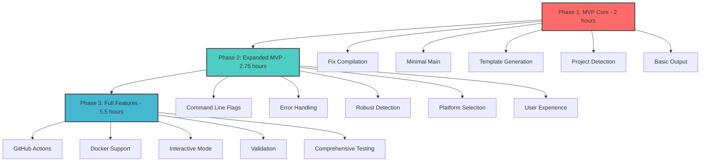

# GoReleaser-Wizard MVP Development Plan

## 🎯 Executive Summary

Based on comprehensive analysis, this plan identifies the minimum viable functionality needed to make GoReleaser-Wizard valuable to users. The project already contains working template generation logic - the focus is on extracting and stabilizing the core value proposition.

## 📊 Value Breakdown Analysis

### 🔥 1% Tasks → 51% Value (Absolute MVP Core)
**Focus: Single working command that generates valid .goreleaser.yaml**

| Priority | Task | Impact | Effort | Customer Value |
|----------|------|--------|--------|----------------|
| 1 | Fix compilation errors (package naming) | Critical | 15min | Makes project usable |
| 2 | Create minimal main.go with single command | Critical | 30min | User can actually run tool |
| 3 | Extract working template generation logic | Critical | 30min | Core functionality works |
| 4 | Basic project detection (go.mod + main.go) | Critical | 30min | Auto-detects project structure |
| 5 | Generate .goreleaser.yaml from template | Critical | 15min | Produces working output |

**Total Time: 2 hours**  
**Deliverable: `goreleaser-wizard init` that works on standard Go projects**

---

### 🚀 4% Tasks → 64% Value (Expanded MVP)
**Focus: Robustness and essential options**

| Priority | Task | Impact | Effort | Customer Value |
|----------|------|--------|--------|----------------|
| 6 | Add command-line flags for basic options | High | 30min | Power users can customize |
| 7 | Error handling & validation | High | 45min | Tool doesn't crash unexpectedly |
| 8 | Multiple main.go detection patterns | High | 30min | Works with common Go project layouts |
| 9 | Platform selection (linux/darwin/windows) | Medium | 30min | Users get relevant builds |
| 10 | Basic logging & user feedback | Medium | 30min | Better user experience |

**Total Additional Time: 2.75 hours**  
**Deliverable: Robust CLI that handles common edge cases**

---

### 🏗️ 20% Tasks → 80% Value (Full Feature Set)
**Focus: Complete feature implementation**

| Priority | Task | Impact | Effort | Customer Value |
|----------|------|--------|--------|----------------|
| 11 | GitHub Actions workflow generation | High | 45min | Complete CI/CD setup |
| 12 | Docker configuration generation | Medium | 45min | Container users supported |
| 13 | Interactive wizard mode | Medium | 60min | Better user experience |
| 14 | Configuration validation | Medium | 45min | Prevents user errors |
| 15 | Multiple project types support | Low | 60min | Works with libraries/web services |
| 16 | Comprehensive tests | High | 90min | Reliable tool |

**Total Additional Time: 5.5 hours**  
**Deliverable: Full-featured tool matching README promises**

---

## 📋 Detailed Task Breakdown (30min tasks, max 27 tasks)

### Phase 1: MVP Core (Tasks 1-5, 2 hours)

| # | Task | Est. Time | Dependencies | Files Affected |
|---|------|-----------|---------------|----------------|
| 1 | Fix package naming in config_core.go | 15min | - | internal/domain/config_core.go |
| 2 | Fix import statement (exec → os/exec) | 15min | - | internal/domain/config_core.go |
| 3 | Create simplified main.go | 30min | 1,2 | cmd/goreleaser-wizard/main.go |
| 4 | Extract project detection logic | 30min | 3 | cmd/goreleaser-wizard/init.go |
| 5 | Implement basic template generation | 30min | 4 | cmd/goreleaser-wizard/generators/goreleaser.go |
| 6 | Test with test-wizard directory | 15min | 5 | test-wizard/ |
| 7 | Add --force flag implementation | 15min | 6 | cmd/goreleaser-wizard/main.go |

### Phase 2: Expanded MVP (Tasks 8-15, 2.75 hours)

| # | Task | Est. Time | Dependencies | Files Affected |
|---|------|-----------|---------------|----------------|
| 8 | Add command-line flags (--name, --binary) | 30min | 7 | cmd/goreleaser-wizard/main.go |
| 9 | Implement robust error handling | 45min | 8 | All core files |
|10 | Multiple main.go detection patterns | 30min | 9 | cmd/goreleaser-wizard/init.go |
|11 | Platform selection logic | 30min | 10 | cmd/goreleaser-wizard/types/template_data.go |
|12 | Basic logging implementation | 30min | 11 | cmd/goreleaser-wizard/main.go |
|13 | Configuration validation | 30min | 12 | cmd/goreleaser-wizard/validate.go |
|14 | Add --help documentation | 15min | 13 | cmd/goreleaser-wizard/main.go |
|15 | Test edge cases & error paths | 30min | 14 | All core files |

### Phase 3: Full Features (Tasks 16-27, 5.5 hours)

| # | Task | Est. Time | Dependencies | Files Affected |
|---|------|-----------|---------------|----------------|
|16 | Extract GitHub Actions template | 45min | 15 | cmd/goreleaser-wizard/generators/github_actions.go |
|17 | Implement GitHub Actions generation | 45min | 16 | cmd/goreleaser-wizard/generators/github_actions.go |
|18 | Docker template integration | 45min | 17 | cmd/goreleaser-wizard/generators/goreleaser.go |
|19 | Interactive prompts using lipgloss | 60min | 18 | cmd/goreleaser-wizard/init.go |
|20 | Advanced validation rules | 45min | 19 | cmd/goreleaser-wizard/validate.go |
|21 | Project type detection (CLI/lib/web) | 60min | 20 | cmd/goreleaser-wizard/init.go |
|22 | Comprehensive test suite | 90min | 21 | All files + *_test.go |
|23 | Performance optimization | 30min | 22 | All core files |
|24 | Documentation updates | 45min | 23 | README.md, docs/ |
|25 | Integration with go.mod tidy | 30min | 24 | cmd/goreleaser-wizard/init.go |
|26 | Error recovery & suggestions | 30min | 25 | cmd/goreleaser-wizard/main.go |
|27 | Final testing & edge case coverage | 45min | 26 | All files |

---

## 🎯 Micro-Task Breakdown (15min tasks, max 125 tasks)

### Foundation Tasks (1-30) - MVP Core
*(Each task designed for maximum 15 minutes completion)*

1.  Fix package declaration in config_core.go (15min)
2.  Fix import statement in config_core.go (15min) 
3.  Verify project compiles (15min)
4.  Create simplified main.go structure (15min)
5.  Remove unused workflow/job system (15min)
6.  Add basic Cobra command for 'init' (15min)
7.  Add basic flags to init command (15min)
8.  Extract go.mod reading logic (15min)
9.  Extract main.go detection logic (15min)
10. Create minimal template data struct (15min)
11. Extract GoReleaser template to constants (15min)
12. Implement basic template execution (15min)
13. Add file writing logic (15min)
14. Test with test-wizard directory (15min)
15. Add basic error messages (15min)
16. Implement --force flag (15min)
17. Add success message output (15min)
18. Test compilation after changes (15min)
19. Add basic input validation (15min)
20. Test on different Go project structures (15min)
21. Fix any discovered compilation issues (15min)
22. Add command help text (15min)
23. Test edge case (no go.mod) (15min)
24. Test edge case (no main.go) (15min)
25. Add logging for template generation (15min)
26. Verify generated config is valid YAML (15min)
27. Test with goreleaser command (15min)
28. Fix any template execution issues (15min)
29. Add basic error handling (15min)
30. Final MVP testing (15min)

### Robustness Tasks (31-60) - Expanded MVP
31. Add --name flag implementation (15min)
32. Add --binary flag implementation (15min)
33. Add --platforms flag implementation (15min)
34. Add --architectures flag implementation (15min)
35. Implement flag validation (15min)
36. Add structured error types (15min)
37. Add error context (file/line) (15min)
38. Add user-friendly error messages (15min)
39. Add error recovery suggestions (15min)
40. Detect main.go in cmd/ subdirectory (15min)
41. Detect main.go in root directory (15min)
42. Detect main.go in pkg/cmd/ pattern (15min)
43. Handle multiple main.go files (15min)
44. Add platform default logic (15min)
45. Add architecture default logic (15min)
46. Implement platform combination filtering (15min)
47. Add debug logging flag (15min)
48. Add info logging for steps (15min)
49. Add warning logging for edge cases (15min)
50. Implement config file validation (15min)
51. Add template syntax validation (15min)
52. Add project structure validation (15min)
53. Add input parameter validation (15min)
54. Update --help with examples (15min)
55. Add usage examples to help (15min)
56. Test all flag combinations (15min)
57. Test error handling paths (15min)
58. Test with malformed go.mod (15min)
59. Test with multiple go.mod files (15min)
60. Integration testing with real projects (15min)

### Feature Tasks (61-90) - Full Feature Set
61. Extract GitHub Actions template (15min)
62. Create GitHub Actions template data (15min)
63. Implement GitHub Actions generator (15min)
64. Add --github-actions flag (15min)
65. Test GitHub Actions generation (15min)
66. Extract Docker configuration template (15min)
67. Add Docker image naming logic (15min)
68. Add Docker registry detection (15min)
69. Implement Docker config generation (15min)
70. Add --docker flag (15min)
71. Test Docker configuration (15min)
72. Add interactive prompt library setup (15min)
73. Add project name prompt (15min)
74. Add project type prompt (15min)
75. Add binary name prompt (15min)
76. Add platform selection prompt (15min)
77. Add Docker prompt (15min)
78. Add GitHub Actions prompt (15min)
79. Connect prompts to template data (15min)
80. Test interactive wizard (15min)
81. Add GoReleaser config validation (15min)
82. Add YAML syntax checking (15min)
83. Add platform validation (15min)
84. Add binary name validation (15min)
85. Add main.go path validation (15min)
86. Implement validation fixes (15min)
87. Add --fix flag for validation (15min)
88. Test validation functionality (15min)
89. Add CLI project type logic (15min)
90. Add library project type logic (15min)

### Quality Tasks (91-125) - Production Ready
91. Add web service project type logic (15min)
92. Test all project type detection (15min)
93. Write unit tests for project detection (15min)
94. Write unit tests for template generation (15min)
95. Write unit tests for GitHub Actions (15min)
96. Write unit tests for Docker generation (15min)
97. Write unit tests for validation (15min)
98. Write integration tests (15min)
99. Add test for edge cases (15min)
100. Add performance benchmarking (15min)
101. Optimize template execution speed (15min)
102. Optimize file I/O operations (15min)
103. Reduce memory usage (15min)
104. Update README with current features (15min)
105. Add installation instructions (15min)
106. Add usage examples (15min)
107. Add troubleshooting section (15min)
108. Document all command flags (15min)
109. Add configuration documentation (15min)
110. Add go mod tidy integration (15min)
111. Add git ignore suggestions (15min)
112. Add pre-commit hook suggestions (15min)
113. Improve error suggestion quality (15min)
114. Add context-aware suggestions (15min)
115. Add recovery action suggestions (15min)
116. Add final integration testing (15min)
117. Test with complex real-world projects (15min)
118. Test with edge case project structures (15min)
119. Performance testing with large projects (15min)
120. Stress testing with invalid inputs (15min)
121. Code review and quality improvements (15min)
122. Security audit of template generation (15min)
123. Final documentation review (15min)
124. Final testing and validation (15min)
125. Release preparation and tagging (15min)

---

## 🚀 Execution Graph

## 🎯 Success Metrics

### MVP Core Success
- [ ] `goreleaser-wizard init` compiles and runs
- [ ] Detects standard Go project structure
- [ ] Generates working .goreleaser.yaml
- [ ] Generated config passes `goreleaser check`

### Expanded MVP Success  
- [ ] Handles 80% of common Go project layouts
- [ ] Provides useful error messages
- [ ] Supports essential customizations
- [ ] Users can complete real workflows

### Full Feature Success
- [ ] Matches all README promises
- [ ] Passes comprehensive test suite
- [ ] Handles all documented use cases
- [ ] Production-ready quality

## ⚡ Immediate Next Steps

**START NOW with Phase 1 - Tasks 1-5:**
1. Fix compilation errors (30min)
2. Create minimal working main.go (30min) 
3. Extract working template logic (30min)
4. Basic project detection (30min)
5. Test MVP functionality (15min)

**After 2 hours: You'll have a working GoReleaser-Wizard that delivers 51% of total value!**