# SUPERB Wizard Modernization — Pareto Execution Plan

**Date:** 2026-08-16 18:45
**Status:** PLANNED — awaiting execution
**Sources:** `docs/research/2026-08-10_GORELASER_17_RESEARCH.md` (research) + re-verification on 2026-08-16 (state drift checked)
**Goal owner:** Lars — "I want to use GoReleaser in pretty much ALL my projects"

---

## 1. The Two Goals

| Goal                           | What it means                                                                                                            | How this plan serves it                                            |
| ------------------------------ | ------------------------------------------------------------------------------------------------------------------------ | ------------------------------------------------------------------ |
| **A) Understand GoReleaser**   | A written knowledge base of modern (v2.17) GoReleaser: sections, phases, deprecations, template vars                     | Task M13 guide + M14/M15 doc truth-up                              |
| **B) A FUCKING superb wizard** | `goreleaser-wizard generate` produces a **modern, valid, non-deprecated, actually-releasable** config for ANY Go project | Waves 1–3 (correctness → single source of truth → automated proof) |

**North Star:** `goreleaser check` on wizard output exits **0 with ZERO deprecations**, and a snapshot release succeeds end-to-end (incl. Docker image).

---

## 2. Verified Current State (2026-08-16)

> Re-verified today. Drift since 2026-08-10 research marked ⬆️changed / =unchanged.

| Fact                                                    | Status                                                                                                                                     |
| ------------------------------------------------------- | ------------------------------------------------------------------------------------------------------------------------------------------ |
| `go build ./...`                                        | ✅ passes (=)                                                                                                                              |
| `go test ./...`                                         | ✅ 5 packages ok (=); 5 packages have **no test files** (=)                                                                                |
| `golangci-lint run`                                     | ✅ **0 issues** ⬆️changed (was 52 — fixed in `9703270`)                                                                                     |
| `nix flake check`                                       | ✅ passes (=)                                                                                                                              |
| `go-arch-lint check`                                    | ✅ passes (=)                                                                                                                              |
| Own `.goreleaser.yaml` vs `goreleaser check` (v2.17.1)  | ❌ deprecated: `dockers`, `docker_manifests`, `brews` (=)                                                                                  |
| Wizard-generated config                                 | ❌ same deprecations + **fails check without `GITHUB_OWNER`/`GITHUB_REPO` env** (=)                                                        |
| Docker enabled → Dockerfile generated?                  | ❌ **never** (`DockerfileGenerator` exists but is dead code; snapshot release dies at docker step) (=)                                     |
| `cmd/goreleaser-wizard/{generators,templates}` packages | ❌ **not imported by binary** — dead; live path is `jobs.go` inline templates + `map[string]any` (=)                                       |
| `before.hooks` of generated config                      | ⚠️ always runs `go test ./...` + `go generate ./...` (=)                                                                                    |
| Generated GH Actions `release.yml`                      | ⚠️ hardcoded `runs-on: [self-hosted, linux, x64]`; docker login + cosign steps always emitted (=)                                           |
| `.orig` files tracked                                   | ❌ 3 still tracked (`main.go.orig`, `validate_main.go.orig`, `errors.go.orig`) (=)                                                         |
| DevShell caches                                         | ⚠️ **NEW:** `/mnt/buildcache` mount broken → `GOCACHE`/`GOMODCACHE`/`GOLANGCI_LINT_CACHE` fail; workaround: override to `/tmp/...` ⬆️changed |
| `GOEXPERIMENT=jsonv2`                                   | required for build (`encoding/json/v2` intentional), undocumented in flake/AGENTS (=)                                                      |

---

## 3. Pareto Breakdown

### The 1% that delivers 51% — _Correct, modern generated output_

1. **Modernize the live GoReleaser template** to v2.17: `dockers_v2`, `homebrew_casks`, `archives.format_overrides.formats`, root-level `retry` (kills every deprecation in one strike).
2. **Env-tolerant release section**: git-detect owner/repo at generate time; `goreleaser check` must pass locally without env vars.
3. **Generate a Dockerfile whenever Docker is enabled** (goreleaser-prebuilt pattern: copy binaries, never rebuild).

> Without these three, the wizard actively harms every project it touches. With them, it already covers the majority of real usage.

### The 4% that delivers 64% — _Single source of truth + CI correctness_

4. Wire the fully-built `generators` package into the job pipeline; delete `jobs.go`'s inline template copies and `map[string]any` data prep (kills the split brain).
5. Fix the GH Actions template: `ubuntu-latest` default, conditional docker-login/cosign steps, buildx setup.
6. Slim `before.hooks` to `go mod tidy` (test/generate opt-in).
7. **E2E proof**: automated test that generates into a temp module and runs `goreleaser check` → zero deprecations.

### The 20% that delivers 80% — _Automated guarantees + knowledge_

8. Golden-file tests for every generated artifact (goreleaser.yaml, release.yml, Dockerfile, cask).
9. CI workflow: lint + test + build + `goreleaser check` on own config + fixture (deprecations can never silently return).
10. **GoReleaser v2.17 knowledge guide** (Goal A) + README/AGENTS/FEATURES truth-up.
11. Hygiene: remove `.orig` files, unused test helper, `infertypeargs` hints.

### The other 20% (to reach 100%) — _Hardening, coverage, release_

12. Error-discarding fixes; parameterize personal defaults (tap repo, NUR, commit author).
13. Tests for the 5 uncovered packages; domain coverage lift.
14. `validate` command learns deprecation detection + migration suggestions.
15. Migrate the wizard's **own** `.goreleaser.yaml` to v2.17; flake cache robustness; TODO_LIST/ROADMAP/CHANGELOG; **tag v1.0.0** and release; verify artifacts + cask end-to-end.

---

## 4. Medium-Granularity Plan — 27 tasks, 30–100 min each

Sorted by importance → impact → customer value (effort shown for planning).

| #   | Wave | Task                                                                                                                                    | Imp | Eff | Cust. value                                     |
| --- | ---- | --------------------------------------------------------------------------------------------------------------------------------------- | --- | --- | ----------------------------------------------- |
| M1  | 1    | Modernize GoReleaser template to v2.17 (`dockers_v2`, `homebrew_casks`, `formats`, root `retry`) in `templates/embedded.go`             | 10  | 90m | Output passes `goreleaser check` — core product |
| M2  | 1    | Owner/repo: git-detect + inject; env-tolerant `release:`; `--github-owner/--github-repo` flags                                          | 9   | 60m | Local check works everywhere                    |
| M3  | 1    | Wire `DockerfileGenerator` into JobFactory (generate Dockerfile when Docker enabled)                                                    | 9   | 60m | Docker releases stop failing                    |
| M4  | 1    | Rewrite Dockerfile template to goreleaser-prebuilt pattern (`FROM scratch`, `ARG TARGETPLATFORM`, `COPY` prebuilt) + distroless variant | 8   | 30m | Fast, correct images                            |
| M5  | 2    | Wire `generators` package into jobs (GoReleaser + GitHubActions generators replace inline funcs)                                        | 9   | 90m | Kills split brain at the source                 |
| M6  | 2    | Delete `jobs.go` inline templates + `map[string]any` prep; route through typed `TemplateData`                                           | 8   | 60m | One source of truth, type safety                |
| M7  | 2    | GH Actions template: `ubuntu-latest` default, conditional docker/cosign steps, buildx setup step                                        | 8   | 60m | Working CI out of the box                       |
| M8  | 2    | `before.hooks`: default `go mod tidy` only; test/generate hooks opt-in                                                                  | 7   | 30m | Fast, unsurprising releases                     |
| M9  | 3    | E2E test: generate into temp module → `goreleaser check` → assert zero deprecations                                                     | 9   | 90m | Correctness is proven, not hoped                |
| M10 | 3    | Golden-file tests for all generated artifacts (4 kinds × variants) with `-update` flag                                                  | 8   | 90m | Regression safety net                           |
| M11 | 3    | CI workflow: lint + test + build + `goreleaser check` (own config + fixture)                                                            | 8   | 60m | Deprecations can't return                       |
| M12 | 4    | Hygiene: `git rm` 3 `.orig` files, `.gitignore *.orig`, remove unused `createTempFile`, fix `infertypeargs`                             | 6   | 30m | Clean repo                                      |
| M13 | 5    | Write `docs/goreleaser-guide.md`: v2.17 concepts, phases, dockers_v2 deep-dive, casks, template vars, snapshot vs release               | 8   | 90m | **Goal A delivered**                            |
| M14 | 5    | README truth-up: verified quick start, v2.17 showcase, honest commands/flags tables                                                     | 7   | 60m | Trustworthy front door                          |
| M15 | 5    | AGENTS.md truth-up: real commands (go/nix), `GOEXPERIMENT=jsonv2` + broken-cache gotchas, real dir listing                              | 6   | 30m | Future sessions don't trip                      |
| M16 | 5    | FEATURES.md honest status refresh                                                                                                       | 5   | 30m | No lying docs                                   |
| M17 | 6    | Fix error-discarding sites (`flags.go`, `init.go:248`, `validate_main.go:167`, `parseGitHubRemote`)                                     | 6   | 60m | Robustness                                      |
| M18 | 6    | Parameterize personal defaults (homebrew tap repo, NUR repo, commit author) → detect + flags                                            | 7   | 60m | Wizard works for any GitHub owner               |
| M19 | 6    | `internal/git` tests (0% → solid): URL parsing, version helpers, edge cases                                                             | 6   | 90m | Coverage + confidence                           |
| M20 | 6    | Tests for `generators`, `templates`, `types`, `internal/config` (0% → solid)                                                            | 6   | 90m | Coverage on real product code                   |
| M21 | 6    | `internal/domain` coverage lift (10% → 60%+): enums, `Validate()`, `ApplyDefaults()`                                                    | 5   | 90m | Protect the core model                          |
| M22 | 6    | `validate` cmd: detect deprecated keys + exact before/after migration hints                                                             | 6   | 60m | Users can self-migrate                          |
| M23 | 6    | Migrate wizard's own `.goreleaser.yaml` to v2.17 + local snapshot verify                                                                | 7   | 60m | Dogfooding proof                                |
| M24 | 6    | flake.nix cache robustness: fall back to local cache dirs when `/mnt/buildcache` is dead                                                | 5   | 30m | DevShell never breaks again                     |
| M25 | 6    | Refresh `TODO_LIST.md` + `ROADMAP.md` from this plan                                                                                    | 5   | 30m | Living docs current                             |
| M26 | 6    | Release v1.0.0: CHANGELOG cut, full gate pass, tag, `goreleaser release`, verify artifacts/docker/cask                                  | 8   | 90m | The wizard ships properly                       |
| M27 | 6    | Post-release verification: cask present in tap, `brew install` path, docker image pull                                                  | 6   | 60m | 100% end-to-end proof                           |

**Total: ~24h of focused work across 27 tasks.**

---

## 5. Fine-Granularity Plan — 93 tasks, ≤12 min each

Sorted by wave → importance. IDs map to medium tasks (`F## = M##`).

### Wave 1 — Correct, modern output (Tier 1: the 1% → 51%)

| #   | Task                                                                                                                   | ≤12m | Verification                           |
| --- | ---------------------------------------------------------------------------------------------------------------------- | ---- | -------------------------------------- |
| F1  | Read `templates/embedded.go` + `types/template_data.go` fully; list every template key and its data source             | 12   | key inventory written in PR body/notes |
| F2  | Template: rewrite `builds`/`archives` (`formats:` list) + `checksum`/`snapshot`                                        | 12   | renders, YAML parses                   |
| F3  | Template: replace `dockers`+`docker_manifests` with `dockers_v2` (`images`,`tags`,`platforms`,`annotations`)           | 12   | no `dockers:` key remains              |
| F4  | Template: replace `brews` with `homebrew_casks` (`directory: Casks`)                                                   | 12   | no `brews:` key remains                |
| F5  | Template: update `nfpms`/`scoops`/`nix` to current key names; move `retry` to root                                     | 12   | docs cross-check                       |
| F6  | Template: review `signs`/`sboms` (cosign keyless OK); drop `mode: append` if unneeded                                  | 12   | `goreleaser check` clean               |
| F7  | Render template manually with test data (CLI or test); eyeball full output                                             | 12   | human review                           |
| F8  | `goreleaser check` on rendered output → **exit 0, zero deprecations**                                                  | 12   | command output                         |
| F9  | Owner/repo: use `internal/git` detection at generate time; default `Env` map from it                                   | 12   | unit test                              |
| F10 | `release:` section env-tolerant (detected defaults; `{{.Env.*}}` only as override)                                     | 12   | check passes w/o env                   |
| F11 | Add `--github-owner` / `--github-repo` flags to `init`+`generate`                                                      | 12   | flag shows in `--help`                 |
| F12 | Test: local `goreleaser check` on fresh generate passes without env vars                                               | 12   | automated                              |
| F13 | Add `DockerfileGenerationJob` to JobFactory when `DockerSupport.IsEnabled()`                                           | 12   | job runs in workflow                   |
| F14 | Implement Dockerfile job rollback (remove generated file)                                                              | 12   | rollback test                          |
| F15 | E2E: `generate` with docker enabled → `Dockerfile` exists in cwd                                                       | 12   | automated                              |
| F16 | Rewrite `DockerfileTemplate`: `FROM scratch` (+distroless variant), `ARG TARGETPLATFORM`, `COPY $TARGETPLATFORM/<bin>` | 12   | renders valid Dockerfile               |
| F17 | Wire binary name into Dockerfile template data (`.Binary`)                                                             | 12   | correct COPY path                      |
| F18 | Snapshot verify: `goreleaser release --snapshot` reaches docker step without "Dockerfile missing"                      | 12   | command output                         |

### Wave 2 — Single source of truth (Tier 2: the 4% → 64%)

| #   | Task                                                                                                                                     | ≤12m | Verification                                     |
| --- | ---------------------------------------------------------------------------------------------------------------------------------------- | ---- | ------------------------------------------------ |
| F19 | `ConfigGenerationJob.Execute` → call `generators.NewGoReleaserGenerator(...).Generate(ctx)`                                              | 12   | tests pass                                       |
| F20 | `GitHubActionsGenerationJob.Execute` → call `GitHubActionsGenerator`                                                                     | 12   | tests pass                                       |
| F21 | JobFactory constructs generators with `LoggerAdapter` (exists in main.go)                                                                | 12   | compiles                                         |
| F22 | Run full test suite; fix breakage from wiring                                                                                            | 12   | `go test ./...` green                            |
| F23 | Delete `goreleaserTemplateContent` + `githubActionsTemplateContent` from `jobs.go`                                                       | 12   | build passes after (build FIRST per AGENTS rule) |
| F24 | Delete `prepareGoReleaserData` / `prepareGitHubActionsData` (`map[string]any`)                                                           | 12   | no map prep remains                              |
| F25 | Delete now-dead helpers (`getVersion`, `getCommitHash`, `runGitCommand`, `addDockerConfig`, `executeTemplate`, `mapToStrings` if unused) | 12   | `go vet` clean, no unused                        |
| F26 | `go build && go test && grep -rn "map\[string\]any" cmd/` → only legitimate uses                                                         | 12   | grep evidence                                    |
| F27 | GH Actions template: `runs-on: ubuntu-latest` default (+ `--runner` option later, M18)                                                   | 12   | renders                                          |
| F28 | GH Actions: docker-login step only `[[if .DockerEnabled]]`                                                                               | 12   | renders both ways                                |
| F29 | GH Actions: cosign step only `[[if .SigningEnabled]]`                                                                                    | 12   | renders both ways                                |
| F30 | GH Actions: add `docker/setup-buildx-action` step when Docker enabled                                                                    | 12   | docs cross-check                                 |
| F31 | Render release.yml for all 4 docker×signing combos; YAML-parse each                                                                      | 12   | automated                                        |
| F32 | Template `before.hooks` = `go mod tidy` only                                                                                             | 12   | golden diff                                      |
| F33 | Config option `RunTests/Generate` → opt-in extra hooks                                                                                   | 12   | unit test                                        |

### Wave 3 — Automated proof (rest of the 20% → 80%)

| #   | Task                                                                                                        | ≤12m | Verification        |
| --- | ----------------------------------------------------------------------------------------------------------- | ---- | ------------------- |
| F34 | E2E scaffolding: temp Go module in `t.TempDir()` + fixture main.go                                          | 12   | reusable helper     |
| F35 | Run generation programmatically in temp module; collect outputs                                             | 12   | files exist         |
| F36 | Exec `goreleaser check` (skip test gracefully if binary missing); assert exit 0 + no "DEPRECATED" in output | 12   | automated           |
| F37 | Wire E2E into normal `go test ./...` run                                                                    | 12   | CI-runnable         |
| F38 | Create `testdata/golden/` layout + golden helper with `-update` flag                                        | 12   | helper works        |
| F39 | Golden: `.goreleaser.yaml` (no-docker variant)                                                              | 12   | diff clean          |
| F40 | Golden: `.goreleaser.yaml` (docker + signing variant)                                                       | 12   | diff clean          |
| F41 | Golden: `release.yml` variants (docker/signing matrix)                                                      | 12   | diff clean          |
| F42 | Golden: `Dockerfile` variants (scratch/distroless)                                                          | 12   | diff clean          |
| F43 | Author `.github/workflows/ci.yml`: lint + test + build matrix                                               | 12   | workflow YAML valid |
| F44 | CI: `goreleaser check` step on own config + generated fixture                                               | 12   | step present        |
| F45 | CI: ensure `release.yml` (own) stays in sync after M23                                                      | 12   | green run           |

### Wave 4 — Hygiene

| #   | Task                                                       | ≤12m | Verification         |
| --- | ---------------------------------------------------------- | ---- | -------------------- |
| F46 | `git rm` the 3 `.orig` files; add `*.orig` to `.gitignore` | 12   | `git ls-files` clean |
| F47 | Remove unused `createTempFile` in `validate_test.go:59`    | 12   | gopls hint gone      |
| F48 | Fix 5 `infertypeargs` hints in `internal/domain/ids.go`    | 12   | gopls hints gone     |

### Wave 5 — Understand GoReleaser (Goal A)

| #   | Task                                                                                                    | ≤12m | Verification                       |
| --- | ------------------------------------------------------------------------------------------------------- | ---- | ---------------------------------- |
| F49 | Guide: core concepts — pipeline phases (build → package → publish), config `version: 2`                 | 12   | section written                    |
| F50 | Guide: `dockers_v2` deep-dive (buildx, publish-phase, snapshot `-amd64` suffix, TARGETPLATFORM context) | 12   | section written                    |
| F51 | Guide: `brews` → `homebrew_casks` migration (before/after YAML)                                         | 12   | section written                    |
| F52 | Guide: template variables reference (`.Version`, `.Tag`, `.Major`, `.Env`, `.IsNightly`…)               | 12   | section written                    |
| F53 | Guide: snapshot vs release, nightlies, cosign/SBOM/attestations, root `retry`                           | 12   | guide complete, linked from README |
| F54 | README: rewrite "What It Generates" for v2.17 sections                                                  | 12   | accurate                           |
| F55 | README: re-run quick start commands verbatim; fix anything broken                                       | 12   | copy-paste works                   |
| F56 | README: update commands/flags tables to reality                                                         | 12   | matches `--help`                   |
| F57 | AGENTS.md: replace `just` commands with real `go`/`nix` commands                                        | 12   | commands exist                     |
| F58 | AGENTS.md: document `GOEXPERIMENT=jsonv2` requirement + broken `/mnt/buildcache` workaround             | 12   | gotcha section                     |
| F59 | AGENTS.md: fix directory-structure listing to actual tree                                               | 12   | matches `ls`                       |
| F60 | FEATURES.md: honest statuses (mark template-vs-runtime reality)                                         | 12   | no contradictions                  |

### Wave 6 — Hardening, coverage, release (the other 20% → 100%)

| #   | Task                                                                                                                    | ≤12m | Verification             |
| --- | ----------------------------------------------------------------------------------------------------------------------- | ---- | ------------------------ |
| F61 | `flags.go`: turn discarded flag errors into explicit bug-panic helper or handle                                         | 12   | no `_ =` discard         |
| F62 | `init.go:248`: handle `filepath.Glob` error                                                                             | 12   | error path tested        |
| F63 | `validate_main.go:167`: handle `DirExists` error (don't conflate with missing)                                          | 12   | error path tested        |
| F64 | `template_data.go`: `parseGitHubRemote` returns real error/empty instead of `"owner"/"repo"` placeholders               | 12   | no placeholder leakage   |
| F65 | Extract hardcoded `LarsArtmann`/tap/NUR/author values into `SafeProjectConfig` fields with git-detected defaults        | 12   | struct fields            |
| F66 | Flags: `--tap-repo`, `--nix-repo`, `--commit-author`, `--runner`                                                        | 12   | `--help`                 |
| F67 | Update golden tests for parameterized defaults                                                                          | 12   | goldens green            |
| F68 | `internal/git` tests: `ParseGitHubURL` table (https/ssh/ssh-with-port/none)                                             | 12   | coverage up              |
| F69 | `internal/git` tests: `GetMajorVersion`, `IncPatchVersion`, `stripVersionPrefix`                                        | 12   | coverage up              |
| F70 | `internal/git` tests: `ParseGitHubURL` fallback + `repositoryInfoPart` behavior                                         | 12   | package ≥70%             |
| F71 | `templates` tests: all 4 embedded templates parse + render with sample data                                             | 12   | package covered          |
| F72 | `types` tests: `NewGoReleaserTemplateData` mapping correctness                                                          | 12   | package covered          |
| F73 | `internal/config` tests: Manager load precedence (defaults < file < env < flags)                                        | 12   | package covered          |
| F74 | `domain` tests: all enum `IsValid` + invalid cases (table-driven)                                                       | 12   | coverage up              |
| F75 | `domain` tests: `SafeProjectConfig.Validate()` table (valid + each error path)                                          | 12   | coverage up              |
| F76 | `domain` tests: `ApplyDefaults()` + `Clone()` invariants                                                                | 12   | domain ≥60%              |
| F77 | `validate` cmd: parse target `.goreleaser.yaml`, flag deprecated keys (`dockers`, `brews`, `format:`)                   | 12   | detection works          |
| F78 | `validate` cmd: print exact before→after migration snippets + deprecation link                                          | 12   | output reviewed          |
| F79 | Own config: `dockers`+`docker_manifests` → `dockers_v2`                                                                 | 12   | deprecation gone         |
| F80 | Own config: `brews` → `homebrew_casks`                                                                                  | 12   | deprecation gone         |
| F81 | Own config: `goreleaser check` → exit 0, zero warnings                                                                  | 12   | command output           |
| F82 | Own config: `goreleaser release --snapshot --clean` full local run                                                      | 12   | succeeds incl. docker    |
| F83 | flake.nix: shellHook fallback — if `/mnt/buildcache` missing, export local `GOCACHE`/`GOMODCACHE`/`GOLANGCI_LINT_CACHE` | 12   | devShell works w/o mount |
| F84 | flake.nix: verify `nix flake check` still passes with fallback                                                          | 12   | all checks pass          |
| F85 | `TODO_LIST.md`: harvest all open items from this plan                                                                   | 12   | file current             |
| F86 | `ROADMAP.md`: refresh long-term items (v3 `dockers` rename, winget/AUR/ko options)                                      | 12   | file current             |
| F87 | CHANGELOG.md: cut v1.0.0 entry summarizing modernization                                                                | 12   | entry written            |
| F88 | Full gate: `go build && go test ./... && golangci-lint run && go-arch-lint check && nix flake check`                    | 12   | all green                |
| F89 | Commit + tag `v1.0.0` (annotated) + push                                                                                | 12   | tag pushed               |
| F90 | Watch GitHub release run; fix any CI-only failures                                                                      | 12   | release published        |
| F91 | Verify release artifacts: archives, checksums, SBOM, signatures, packages                                               | 12   | artifacts present        |
| F92 | Verify `ghcr.io` image + manifest (both arches) pullable                                                                | 12   | `docker pull` OK         |
| F93 | Verify homebrew cask landed in tap; document install test                                                               | 12   | cask present             |

---

## 6. Execution Graph (mermaid.js)

```mermaid
flowchart TD
    START((Start)) --> V0[Verify baseline:<br/>build + test + lint green]

    subgraph W1["Wave 1 — Tier 1: 1% → 51% (M1-M4)"]
        M1[M1: Modernize template<br/>dockers_v2 / casks / formats] --> M2[M2: Owner-repo detection<br/>env-tolerant release]
        M1 --> M4[M4: Dockerfile template<br/>scratch + TARGETPLATFORM]
        M2 --> M3[M3: Wire DockerfileGenerator<br/>into JobFactory]
        M4 --> M3
    end

    V0 --> W1

    subgraph W2["Wave 2 — Tier 2: 4% → 64% (M5-M8)"]
        M5[M5: Wire generators package] --> M6[M6: Delete jobs.go inline<br/>templates + map string any]
        M6 --> M7[M7: GH Actions template<br/>conditional + ubuntu-latest]
        M7 --> M8[M8: Slim before.hooks]
    end

    M3 --> G1{{Gate 1:<br/>generated output passes<br/>goreleaser check clean?}}
    G1 -- yes --> W2
    G1 -- no --> W1

    subgraph W3["Wave 3 — Automated proof (M9-M11)"]
        M9[M9: E2E goreleaser check test] --> M10[M10: Golden-file tests]
        M10 --> M11[M11: CI workflow]
    end

    M8 --> G2{{Gate 2:<br/>single template source,<br/>all tests green?}}
    G2 -- yes --> W3
    G2 -- no --> W2

    subgraph W4["Wave 4-5 — Hygiene + Knowledge (M12-M16)"]
        M12[M12: .orig + hygiene] 
        M13[M13: goreleaser-guide.md<br/>GOAL A]
        M13 --> M14[M14: README truth-up]
        M14 --> M15[M15: AGENTS.md truth-up]
        M15 --> M16[M16: FEATURES.md]
        M12 --> M13
    end

    M11 --> W4

    subgraph W6["Wave 6 — Hardening → Release (M17-M27)"]
        M17[M17: Error-discarding fixes] --> M18[M18: Parameterize personal defaults]
        M18 --> M19[M19: git tests]
        M19 --> M20[M20: generators/templates/types/config tests]
        M20 --> M21[M21: domain coverage]
        M21 --> M22[M22: validate deprecation hints]
        M22 --> M23[M23: Own config to v2.17]
        M23 --> M24[M24: flake cache fallback]
        M24 --> M25[M25: TODO_LIST + ROADMAP]
        M25 --> M26[M26: Release v1.0.0]
        M26 --> M27[M27: Post-release verify<br/>cask + docker + artifacts]
    end

    M16 --> G3{{Gate 3:<br/>docs truthful,<br/>CI green?}}
    G3 -- yes --> W6
    G3 -- no --> W4

    M27 --> G4{{Gate 4:<br/>v1.0.0 released,<br/>end-to-end verified?}}
    G4 -- yes --> DONE(((DONE:<br/>superb wizard)))
    G4 -- no --> W6
```

**Critical path:** M1 → M3 → Gate 1 → M5 → M6 → Gate 2 → M9 → M11 → Gate 3 → M23 → M26 → M27.

---

## 7. Verification Strategy (gates, not vibes)

| Gate               | Command / check                                     | Must be                       |
| ------------------ | --------------------------------------------------- | ----------------------------- |
| Every task         | `go build ./...`                                    | exit 0                        |
| Every wave end     | `go test ./...`                                     | all green                     |
| Template changes   | render + `goreleaser check`                         | exit 0, **zero deprecations** |
| Deletions (M6/M12) | build FIRST, then fix callers (AGENTS rule)         | cascade caught early          |
| Pre-release        | lint + arch-lint + nix flake check + E2E            | all green                     |
| Release            | GitHub release run + artifacts + cask + docker pull | all verified                  |

**Environment note:** while `/mnt/buildcache` is broken, run Go tools with
`GOCACHE=/tmp/gw-cache GOMODCACHE=/tmp/gw-modcache GOLANGCI_LINT_CACHE=/tmp/gw-lint-cache`.
F83/F84 make this permanent in the devShell.

---

## 8. Guardrails — NO VERSCHLIMMBESSERUNG

1. **Don't rewrite the domain model.** It's rich and validated; we only consume it.
2. **Don't rename packages or public identifiers** during wiring (M5/M6) — move call sites, not names.
3. **Delete-then-build:** after any deletion, run `go build` IMMEDIATELY before editing dependents.
4. **No behavior changes without a test** proving old behavior was wrong.
5. **One logical change per commit**; full gate green before each commit.
6. **Templates are the product.** Any template edit requires a `goreleaser check` proof (F8-class verification), not eyeballing.
7. Don't touch `go.mod` dependencies or Go version — module is healthy.
8. Respect the auto-git daemon: commit only coherent, reviewed states; never commit half-broken trees.
9. `.orig` files: they're stale backups (verified vs git history `fa648db`) — safe to `git rm`, but re-diff against current files first at execution time.

## 9. Open Decisions (default chosen, flag if wrong)

1. **Docker**: `dockers_v2` publish-phase behavior accepted (matches upstream direction). Default: yes.
2. **Runner**: generated workflows default `ubuntu-latest`; self-hosted becomes an option. Default: yes.
3. **Homebrew**: casks (`homebrew_casks`) for new projects; old formulas in LarsArtmann/tap get cleaned in M27. Default: yes.
4. **Dead packages**: wire `generators` in (M5) rather than delete them — they're already built and typed. Default: yes.
5. **`encoding/json/v2`**: stays; documented (M15) instead of reverted. Default: yes.

## 10. Definition of Done

- [ ] `goreleaser-wizard generate` output passes `goreleaser check` (v2.17.1) with **zero deprecations**, no env vars required
- [ ] Docker-enabled projects get a working Dockerfile; snapshot release reaches the end
- [ ] One template source of truth; zero `map[string]any` in generation path
- [ ] E2E + golden tests in CI; deprecations structurally impossible to reintroduce
- [ ] `docs/goreleaser-guide.md` exists and teaches v2.17 (Goal A)
- [ ] Wizard's own config on v2.17; v1.0.0 tagged, released, artifacts verified
- [ ] All gates green; docs truthful (README/AGENTS/FEATURES/TODO_LIST/ROADMAP/CHANGELOG)
